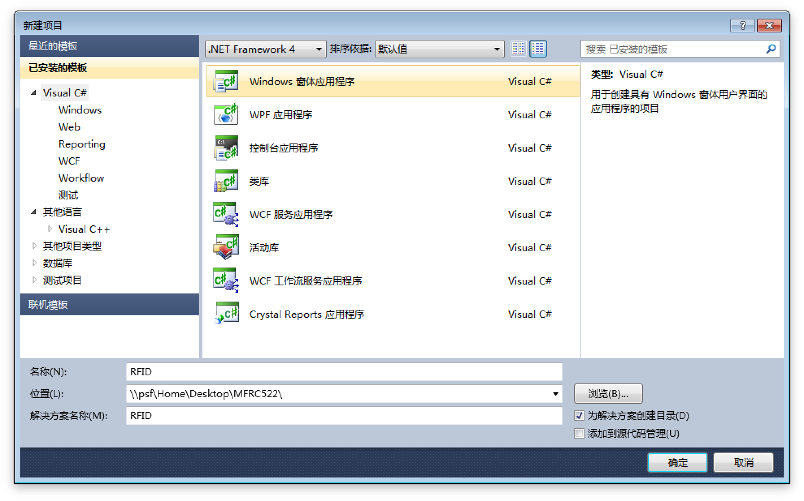
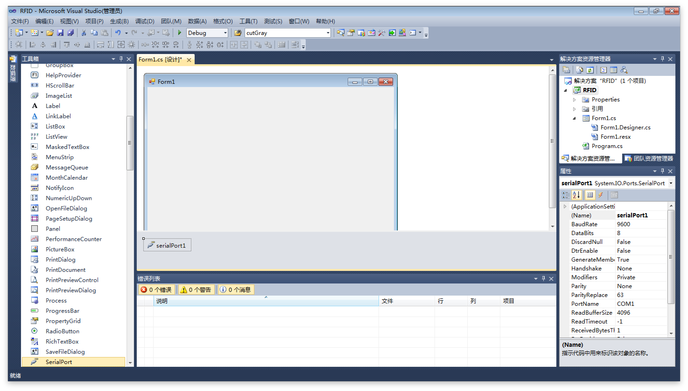
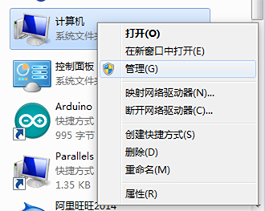
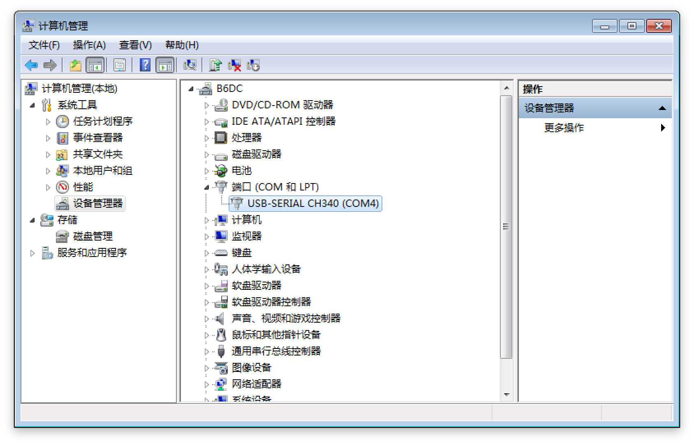
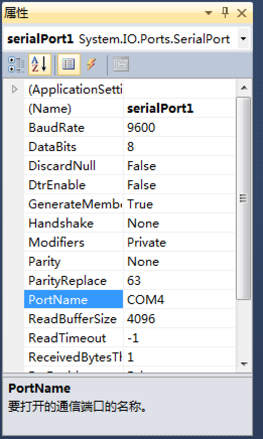
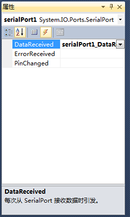
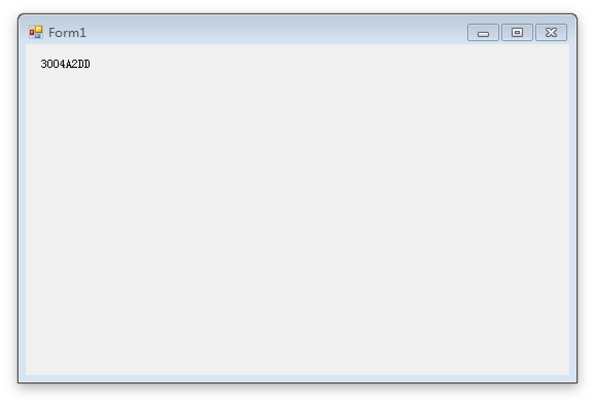

#RFID读卡器

##介绍

今天要教大家做的东西是一个**RFID读卡器**,程序已经**预先烧入单片机**中,同学们只需正确接线,即可利用**几行简单的代码**读取RFID卡片.

##原料

* Arduino Nano
* MFRC522 RFID模块
* 蜂鸣器
* 导线
* USB连接线

##制作过程

###RC522

首先将**RC522**与**Arduino**连接起来,对应关系如下表:

| RC522 | Arduino |
|------:|:--------|
| SDA	| D9	|
| SCK	| D13	|
| MOSI	| D11	|
| MISO	| D12	|
| GND	| GND	|
| RST	| D5	|
| 3.3V	| 3V3	|

###蜂鸣器

然后将**蜂鸣器**接到单片机上,对应关系如下表:

| 蜂鸣器 | Arduino |
|------:|:--------|
| 长的脚	| D6	|
| 短的脚	| GND	|

* 注意:单片机有两个GND,任意接一个都行.

##安装驱动

做完了上面两步之后,就可以将USB线接入电脑了.
我们需要为Arduino安装CH340串口驱动.
大家只需要打开**CH341SER**文件夹里面的**SETUP.EXE**并安装即可.


##开始编程

###创建工程



* 左边选择**Visual C#**工程
* 中间选择**Windows 窗体应用程序**
* 下面的**名称**自己随便取一个

###使用SerialPort(串口)

从左边的**工具箱**找到**SerialPort**,拖到右边的窗口中.

> **串口**是电脑与单片机通信的控件,我们可以利用串口发送数据给单片机,单片机也可以发送数据到电脑上.所以串口是全双工的.



点击刚才生成的**serialPort1**,我们可以从右边的**属性栏**看到我们可以设置的属性.

| 属性	| 中文	| 说明	|
|----	|----	|----	|
| BaudRate	| 波特率	| 只有两边都设置**一样的波特率**时才能正常通信 |
| PortName	| 串口号	| 串口号在**设备管理器**中可以看到,代表了设备的代号	|

这里我们只需要看一看单片机的串口号,并在属性中设置好,单片机的波特率默认是**9600**,可以在**MFRC522.ino**中查看.

设备管理器可以在**我的电脑**右击,**管理**中找到.





这里我们的串口号是**COM4**,所以我应该设置成这样:



###开始写代码

设置好串口之后,我们就可以开始写代码了.

双击窗口**空白处**,进入**Form1_Load**函数,这个函数就像是**main**函数一样,是窗口载入之后第一个执行的函数.

我们在这里写下两行代码:

```
Control.CheckForIllegalCrossThreadCalls = false;
serialPort1.Open();
```

然后我们从窗口中拖出一个**Label**,用来显示我们读到的卡号.

接下来我们写串口的**数据到达事件**.

如下图,点击上面的**闪电**标志,然后找到**DataReceived**,双击右边的编辑框,进入**serialPort1_DataReceived**函数.



我们可以写下如下代码

```
String rfid = serialPort1.ReadLine();
label1.Text = rfid;
```

然后按`F5`运行

我们刷一下卡,屏幕上就会出现我们的RFID卡的ID,如图:



教程到此结束

##抛砖引玉

大家通过这个rfid,可以发挥自己的想象,实现各种功能.

比如:

1. 图书馆借书
2. 食堂消费
3. 澡堂/打开水
4. 银行电子现金
5. 打卡签到
6. 门禁系统

我们就门禁系统举一个例子:

```
if(rfid == "3004A2DD"){
	kaimen();
}
```

**kaimen**函数可以发送数据给单片机,再由单片机**执行**开门动作,即可实现一个简单的**门禁系统**.